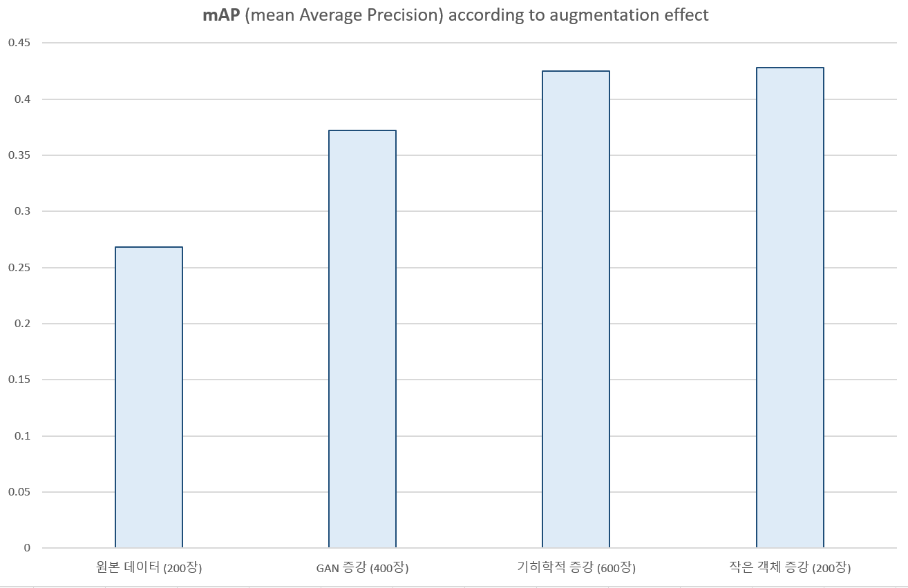

# Case study on application of intelligent technology to military drones

## 실험 결과

<table>
  <tr>
    <td><b>[원본 데이터 (200장)]</b>  </td>
    <td><b>[GAN 증강 (400장)]</b>  </td>
  </tr>
  <tr>
    <td><b>[기하학적 증강 (600장)]</b>   </td>
    <td><b>[작은 객체 증강(200장)]</b>  </td>
  </tr>
</table>

## 데이터셋

### 원본 데이터

 데이터셋 예시
<table>
  <tr>
    <td></td>
    <td></td>
  </tr>
</table>

### GAN 증강

 데이터셋 예시
<table>
  <tr>
    <td></td>
    <td></td>
  </tr>
</table>

### 작은 객체 증강

 데이터셋 예시
<table>
  <tr>
    <td></td>
    <td></td>
  </tr>
</table>

### 기하학적 증강

 데이터셋 예시
<table>
  <tr>
    <td></td>
    <td></td>
    <td></td>
  </tr>
</table>

### 테스트 데이터셋

 데이터셋 예시
<table>
  <tr>
    <td></td>
    <td></td>
  </tr>
  <tr>
    <td></td>
    <td></td>
  </tr>
</table>

